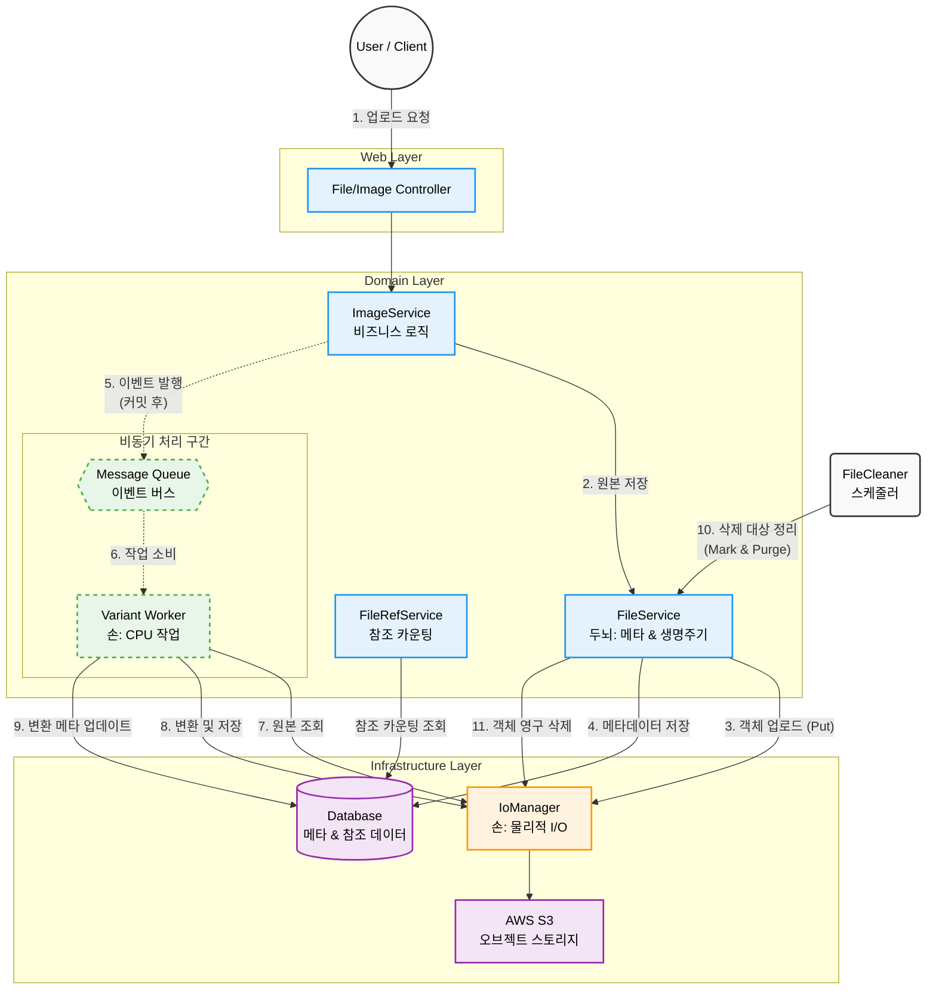

```mermaid
graph TD
    %% --- 스타일 정의 (글자색 검정) ---
    classDef actor fill:#f9f9f9,stroke:#333,stroke-width:2px,color:#000;
    classDef service fill:#e3f2fd,stroke:#2196f3,stroke-width:2px,color:#000;
    classDef infra fill:#fff3e0,stroke:#ff9800,stroke-width:2px,color:#000;
    classDef async fill:#e8f5e9,stroke:#4caf50,stroke-width:2px,stroke-dasharray: 5 5,color:#000;
    classDef db fill:#f3e5f5,stroke:#9c27b0,stroke-width:2px,color:#000;

    %% --- 노드 정의 ---
    User(("User / Client")):::actor
    Scheduler("FileCleaner<br/>스케줄러"):::actor

    subgraph WebLayer [Web Layer]
        Controller["File/Image Controller"]:::service
    end

    subgraph DomainLayer [Domain Layer]
        ImageService["ImageService<br/>비즈니스 로직"]:::service
        FileService["FileService<br/>두뇌: 메타 & 생명주기"]:::service
        RefService["FileRefService<br/>참조 카운팅"]:::service
        
        subgraph AsyncZone [비동기 처리 구간]
            MQ{{"Message Queue<br/>이벤트 버스"}}:::async
            Worker["Variant Worker<br/>손: CPU 작업"]:::async
        end
    end

    subgraph InfraLayer [Infrastructure Layer]
        IoManager["IoManager<br/>손: 물리적 I/O"]:::infra
        S3["AWS S3<br/>오브젝트 스토리지"]:::db
        DB[("Database<br/>메타 & 참조 데이터")]:::db
    end

    %% --- 흐름 1: 업로드 (Fast Path - Sync) ---
    User -->|"1. 업로드 요청"| Controller
    Controller --> ImageService
    ImageService -->|"2. 원본 저장"| FileService
    FileService -->|"3. 객체 업로드 (Put)"| IoManager
    IoManager --> S3
    FileService -->|"4. 메타데이터 저장"| DB

    %% --- 흐름 2: 비동기 변환 (Slow Path - Async) ---
    ImageService -. "5. 이벤트 발행<br/>(커밋 후)" .-> MQ
    MQ -. "6. 작업 소비" .-> Worker
    Worker -->|"7. 원본 조회"| IoManager
    Worker -->|"8. 변환 및 저장"| IoManager
    Worker -->|"9. 변환 메타 업데이트"| DB

    %% --- 흐름 3: GC (Lifecycle) ---
    RefService -->|"참조 카운팅 조회"| DB
    Scheduler -- "10. 삭제 대상 정리<br/>(Mark & Purge)" --> FileService
    FileService -->|"11. 객체 영구 삭제"| IoManager
```